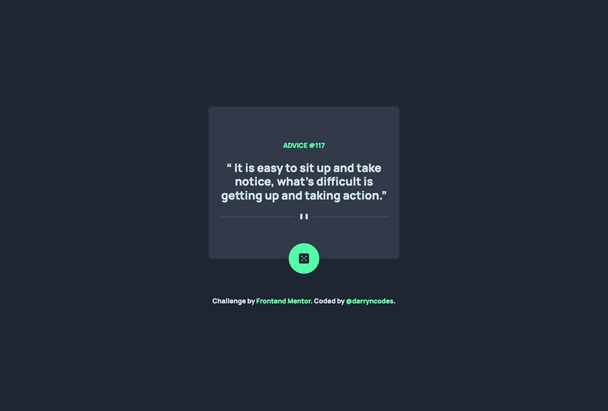
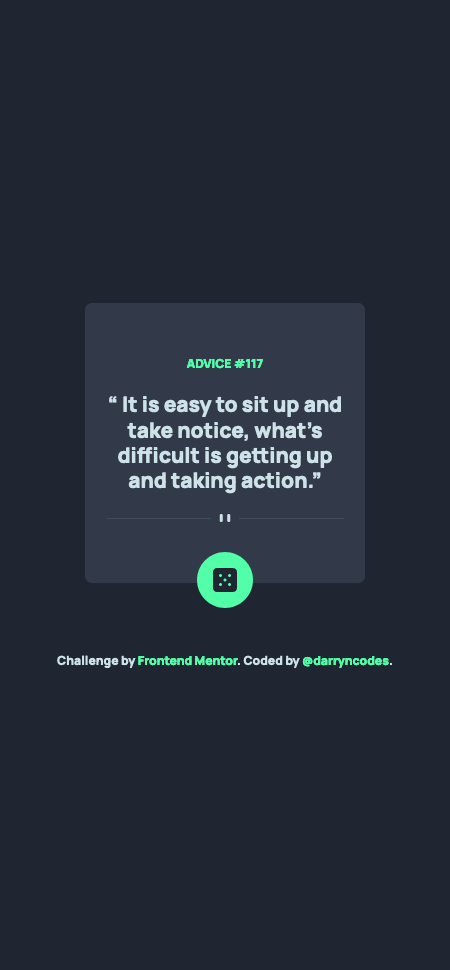

# Frontend Mentor - Advice generator app solution

This is a solution to the [Advice generator app challenge on Frontend Mentor](https://www.frontendmentor.io/challenges/advice-generator-app-QdUG-13db). Frontend Mentor challenges help you improve your coding skills by building realistic projects.

## Table of contents

- [Overview](#overview)
  - [The challenge](#the-challenge)
  - [Screenshot](#screenshot)
  - [Links](#links)
- [My process](#my-process)
  - [Built with](#built-with)
  - [What I learned](#what-i-learned)
  - [Useful resources](#useful-resources)
- [Author](#author)

**Note: Delete this note and update the table of contents based on what sections you keep.**

## Overview

### The challenge

Users should be able to:

- View the optimal layout for the app depending on their device's screen size
- See hover states for all interactive elements on the page
- Generate a new piece of advice by clicking the dice icon

### Screenshot

### Links

- [GitHub repo](https://github.com/darryncodes/advice-generator-app)
- [Solution URL](https://darryncodes.github.io/advice-generator-app/)

## My process

### Built with

- Semantic HTML5 markup
- SCSS
- JS
- Flexbox
- Mobile-first workflow
- BEM methodology

### What I learned

- Practical experience working with APIs, async and await

### Useful resources

- [Pure CSS Loaders](https://loading.io/css/)

## Author

- Work in progress portfolio site - [@darryncodes](https://www.darryncodes.co.uk/)
- Frontend Mentor - [@darryncodes](https://www.frontendmentor.io/profile/darryncodes)
- Twitter - [@darryncodes](https://twitter.com/darryncodes)
